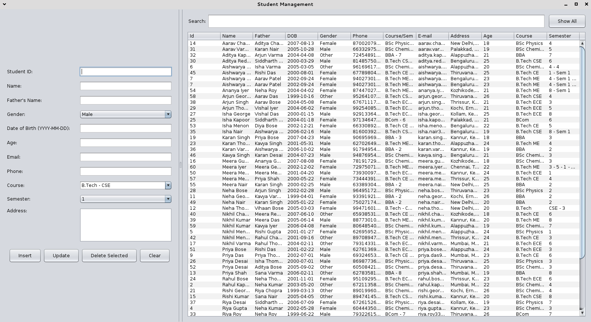

# Student Management System (Java + SQLite)

A modern, lightweight **Student Management System** built in **Java Swing** using **SQLite** as the local database.  
It provides an easy-to-use interface to manage student records — add, edit, delete, and search — all within a clean and responsive UI.

---

## Features

- Add, update, delete, and search student records  
- Modern and responsive Swing-based UI  
- SQLite integration (no external server needed)  
- Auto-calculates **Age** from **Date of Birth (DOB)**  
- Clean separation of UI and database logic (`StudentManagement.java` + `Database.java`)  
- Works offline — perfect for school or college projects  

---

## Database Structure

**Table:** `students`

| Column Name  | Type    | Description                     |
|---------------|----------|---------------------------------|
| id            | TEXT (PK) | Unique student ID               |
| name          | TEXT     | Student full name               |
| gender        | TEXT     | Gender (Male/Female/Other)      |
| dob           | TEXT     | Date of Birth (YYYY-MM-DD)      |
| age           | INTEGER  | Auto-calculated from DOB        |
| email         | TEXT     | Email address                   |
| phone         | TEXT     | Contact number                  |
| address       | TEXT     | Permanent address               |
| father_name   | TEXT     | Father’s full name              |
| course        | TEXT     | Course enrolled (e.g., B.Tech)  |
| semester      | TEXT     | Current semester (e.g., Sem 3)  |

---

## Technologies Used

| Category | Tools |
|-----------|-------|
| Programming Language | **Java (JDK 8 or higher)** |
| GUI Framework | **Swing** |
| Database | **SQLite** |
| IDE | **NetBeans** (recommended) |
| JDBC Driver | `sqlite-jdbc` |

---

## Setup Instructions

### 1. Clone the Repository
```bash
git clone https://github.com/yourusername/student-management-system-java.git
cd student-management-system-java
```

### 2. Open in NetBeans
- Open **NetBeans**
- Go to **File → Open Project**
- Select this folder  
- Wait for dependencies to load

### 3. Add SQLite JDBC Driver
1. Download the latest **sqlite-jdbc** `.jar` file from [https://github.com/xerial/sqlite-jdbc](https://github.com/xerial/sqlite-jdbc)  
2. In NetBeans → Right-click your project → **Properties → Libraries → Add JAR/Folder**  
3. Add the `.jar` file you downloaded  

### 4. Run the Project
- Right-click the project → **Run** (or press F6)  
- The database file `student.db` will be automatically created in your project folder  

---

## Screenshot



---
## How It Works

1. On startup, the app checks for `student.db` and creates it if not found.  
2. `Database.java` handles all SQL operations (Create, Read, Update, Delete).  
3. The `StudentManagement.java` UI calls the database functions and updates the JTable dynamically.  
4. Age is automatically computed from DOB each time a record is added or updated.

---

## Project Structure

```
src/
 └── com/
      └── StudentManagement/
          ├── Database.java          # Handles SQLite operations
          └── StudentManagement.java # GUI + logic
```

---

## Authors


Some B.Tech Computer Science Student (KTU)  

---

## Future Improvements

- Add login system (Admin / Teacher)  
- Export student data to Excel or PDF  
- Use modern JavaFX UI with themes  
- Add cloud database option (MySQL)  

---

## License

This project is licensed under the **MIT License** - see the [LICENSE](LICENSE) file
